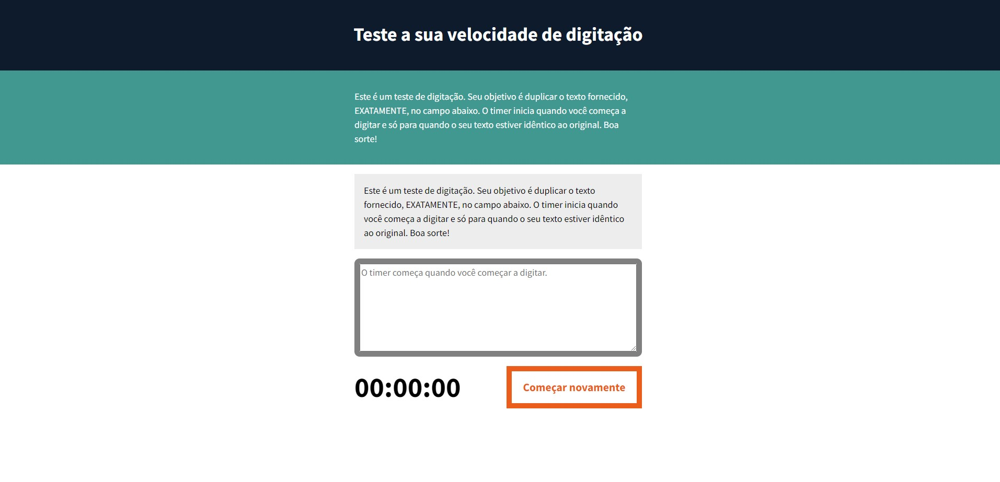

<h1 align="center"> Testando sua velocidade na digitação </h1>

Desenvolvido pelo curso de Java Script Formação Básica no Linkedin Learning.  

  

## 🚀 Tecnologias

Esse projeto foi desenvolvido com as seguintes tecnologias:

- HTML e CSS
- JavaScript
- Git e Github

## 💻 Projeto

Projeto voltado para mostrar velocidade na digitação com foco no Java Script, além do HTML e CSS.

- [visite o projeto online] (https://gsilvaol.github.io/nlw-setup/)
